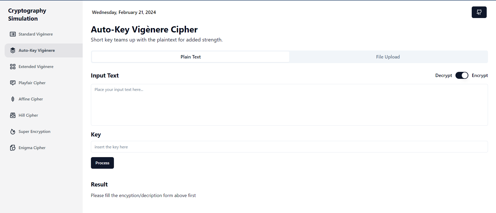
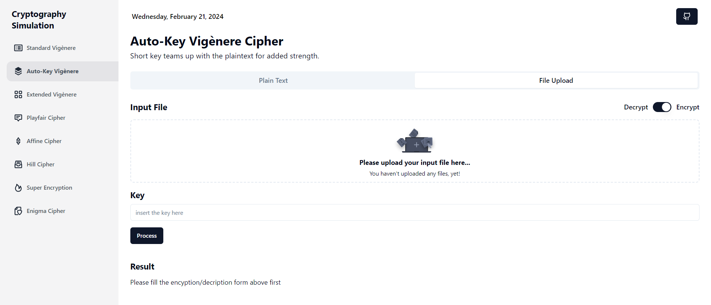

# 🔐 Classic Cryptography Simulator
> Frontend side of Simulator for Well-known Classic Cipher Algorithms with React Typescript and Golang

## General Information
This program is created to simulate some popular classic cryptography algorithms built under the web. Dive into the captivating world of classic cryptography with this interactive simulator! Experiment with renowned algorithms like Caesar and Vigenere Ciphers, encrypt messages beyond the alphabet with extended ASCII support, and handle both text snippets and entire files. Decrypt hidden messages, craft your own secret codes, and gain a deeper understanding of this fascinating field. Unleash your inner codebreaker and embark on this intriguing cryptographic journey!

## Project Structure
```bash
.
├─── public
│   └─── vite.svg
├─── src
│   ├─── api
│   │   └─── index.ts
│   ├─── assets
│   │   ├─── icons
│   │   └─── images
│   ├─── components
│   │   ├─── AffineFile
│   │   ├─── AffineText
│   │   ├─── AutoKeyVigenereFile
│   │   ├─── AutoKeyVigenereText
│   │   ├─── EnigmaFile
│   │   ├─── EnigmaText
│   │   ├─── ExtendedVigenereFile
│   │   ├─── ExtendedVigenereText
│   │   ├─── HillFile
│   │   ├─── HillText
│   │   ├─── Navbar
│   │   ├─── PlayfairFile
│   │   ├─── PlayfairMatrix
│   │   ├─── PlayfairText
│   │   ├─── Sidebar
│   │   ├─── StandardVigenereFile
│   │   ├─── StandardVigenereText
│   │   ├─── SuperEncryptionFile
│   │   ├─── SuperEncryptionText
│   │   ├─── ui
│   │   └─── index.ts
│   ├─── lib
│   │   └─── utils.ts
│   ├─── pages
│   │   ├─── Affine
│   │   ├─── AutoKeyVigenere
│   │   ├─── Enigma
│   │   ├─── ExtendedVigenere
│   │   ├─── Hill
│   │   ├─── NotFound
│   │   ├─── Playfair
│   │   ├─── StandardVigenere
│   │   ├─── SuperEncryption
│   │   └─── index.ts
│   ├─── routes
│   │   └─── index.ts
│   ├─── types
│   │   └─── index.ts
│   ├─── utils
│   │   ├─── fileProcessor.tsx
│   │   ├─── index.tsx
│   │   ├─── setPage.tsx
│   │   └─── textProcessor.tsx
│   ├─── App.css
│   ├─── App.tsx
│   ├─── index.css
│   ├─── main.tsx
│   └─── vite-env.d.ts
├─── .env
├─── .env.example
├─── .eslintrc.cjs
├─── .gitignore
├─── components.json
├─── index.html
├─── package-lock.json
├─── package.json
├─── postcss.config.js
├─── README.md
├─── tailwind.config.js
├─── tsconfig.json
├─── tsconfig.node.json
└─── vite.config.ts
```

## 🔣 &nbsp;Algorithms
Algorithm implemented on backend side. Further implementation of various cipher algorithm stated on [this repository](https://github.com/GoDillonAudris512/Classic-Cryptography-Simulator-Backend)

## ⚙️ &nbsp;How to Compile and Run the Program
Clone this repository from terminal with this command
``` bash
$ git clone https://github.com/mikeleo03/Classic-Cryptography-Simulator-Frontend.git
```
### Run the application on development server
Compile and download some required modules by running the following *command*
``` bash
$ npm install
$ npm run dev
```
If you do it correctly, the program should be running on localhost:3000. Don't forget to run the backend side also. Further explanation on how to run the backend development server stated on [this repository](https://github.com/GoDillonAudris512/Classic-Cryptography-Simulator-Backend)

## Available Scripts
In the project directory, you can run:

### `npm run dev`

Ths runs the app in the development mode.

The page will reload if you make edits.<br />
You will also see any lint errors in the console. You can also use the environment by appyling the basic .env configuration on .env.example file.

## 📸 &nbsp;Screenshots



## Authors
| Name                     |   Role   |  
| ------------------------ | -------- |
| Go Dillon Audris         | Back-end Engineer
| Michael Leon Putra Widhi | Front-end Engineer
